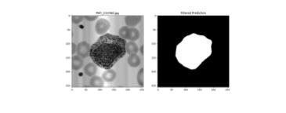

## Hi there 👋 I am Mir DataScientist | MLOps | System Engineer | Electrical and Computer Eng. Phd.-Ing

- Possessing over a decade of experience in designing cutting-edge hardware and algorithms for medical devices (designed more than 10 Medical Sensors from scrach idea to preproduct stage).
- Over 10 years of pureR & D experience in world class organizations such as Huawei sensor Lab, Technical University of Munich, Helmholtz Zentrum, and various startup companies.
- Expert in using Python, Matlab
- Solid foundation in Mathematics, Statistics, signal/Image processing.
- Developer of end-to-end AI/ML/DL projects, collaborating with cross-functional teams.
-  🔭 I’m currently learning MLOps techniques, Continuous Integration and Deployment, DataOps - Isolation, DataOps - Orchestration,  Monitoring.  
- 🌱 I’m currently working on different Datascience projects such as Red Blood Cell Identifier, Stock Market nalysis, and Blood glucose prediction. 

---

### Connect with me:

  

---
### 🏅 My Professional Badges

  
  
  

### 🛠 Skills

  
  
  
  

### Projects

<table>
  <tr>
    <th style="text-align:left">Project</th>
    <th style="text-align:left">Techniques</th>
    <th style="text-align:left">Data Types</th>
    <th style="text-align:left">Poster</th>
  </tr>
  <tr>
    <td>
      <a href="https://github.com/mirmehdi/RBCells_BigData_CNN.git"><strong>BloodPy-Automated Blood Cell Classifier</strong></a> 
      <em>Multi-Classification of Peripheral Blood Cells using Deep Convolutional Neural Networks and Machine Learning Models.</em>
    </td>
    <td>
      - Deep CNN 
      - Data Augmentation 
      - Transfer Learning 
      - U-Net 
      - Image Processing 
      - Statistical Analysis 
      - OpenCV 
      - Fine-tuning
    </td>
    <td>
      - Microscopy Images based on Munich/Barcelona Hospital images.  
    </td>
    <td></td>
  </tr>
</table>
