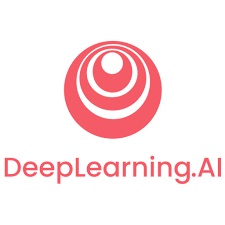

## Hi there 👋 I am Mir DataScientist | MLOps | System Engineer | Electrical and Computer Eng. Phd.-Ing

- Possessing over a decade of experience in designing cutting-edge hardware and algorithms for medical devices (designed more than 10 Medical Sensors from scrach idea to preproduct stage).
- Over 10 years of pureR & D experience in world class organizations such as Huawei sensor Lab, Technical University of Munich, Helmholtz Zentrum, and various startup companies.
- Expert in using Python, Matlab
- Solid foundation in Mathematics, Statistics, signal/Image processing.
- Developer of end-to-end AI/ML/DL projects, collaborating with cross-functional teams.
-  🔭 I’m currently learning MLOps techniques, Continuous Integration and Deployment, DataOps - Isolation, DataOps - Orchestration,  Monitoring.  
- 🌱 I’m currently working on different Datascience projects such as Red Blood Cell Identifier, Stock Market nalysis, and Blood glucose prediction. 

---

### Connect with me:

  

---
### 🏅 My Professional Badges
### 🏅 My Professional Badges

  

