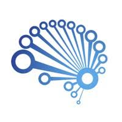

## Hi there 👋 I am Mir Mehdi (PhD.,-Ing): DataScientist | MLOps | Tech Leader. 

- 🚀 Possessing over a decade of experience in designing cutting-edge hardware and algorithms for medical devices (designed more than 10 Medical Sensors from scratch idea to preproduct stage).
- 🏢 Over 10 years of pure R&D experience in world-class organizations such as Huawei Sensor Lab, Technical University of Munich, Helmholtz Zentrum, and various startup companies.
- 🎓 Having a PhD in Electronic and Informatics from Technical Univerisity of Munich.
- 📜 Certified Data Scientist and MLOps Engineer from Datascientest and University of Sorbonne.
- 🖥️ Expert in using Python, Matlab.
- 📊 Solid foundation in Mathematics, Statistics, signal/Image processing.
- 🤖 Developer of end-to-end AI/ML/DL projects, collaborating with cross-functional teams.
- 🔭 I’m currently learning MLOps techniques, Continuous Integration and Deployment, DataOps - Isolation, DataOps - Orchestration, Monitoring.
- 🌱 I’m currently working on different Datascience projects such as Red Blood Cell Identifier, Stock Market Analysis, and Blood Glucose Prediction.
---

### Connect with me:

  

---
🏅 My Professional Badges

  
  
  

### 🛠 Skills

### Projects

<table>
  <tr>
    <th style="text-align:left">Project Title</th>
    <th style="text-align:left">Techniques</th>
    <th style="text-align:left">Data Types</th>
    <th style="text-align:left">Cover</th>
    
  </tr>
  <tr>
    <td>
      <a href="https://github.com/mirmehdi/RBCells_BigData_CNN.git"><strong>BloodPy-Automated Blood Cell Classifier</strong></a> 
      <em>Multi-Classification of Peripheral Blood Cells using Deep Convolutional Neural Networks and Machine Learning Models.</em>
    </td>
    <td>
      - Deep CNN 
      - Data Augmentation 
      - Transfer Learning 
      - U-Net 
      - Image Processing 
      - Statistical Analysis 
      - OpenCV 
      - Fine-tuning
    </td>
    <td>
      - Microscopy Images based on Munich/Barcelona Hospital images.  
    </td>
    <td></td>
  </tr>

  <tr>
  <td>
    <a href="https://github.com/Flocken-Migrationforce/JUL24_BMLOps_Stock_market.git">
      <strong>Stock Market Prediction</strong>
    </a> 
    <em>Predicted stock values for various stocks, including Apple.</em>
  </td>
        <td>
        - LSTM neural network 
      </td>
      <td>
        - realtime Data import 
      </td>
      <td></td>
    </tr>

--- glucose
  <tr>
      <td>
        <a href="https://github.com/mirmehdi/NonInvasive_GlucoseDetectoin.git"><strong>calibration and prediction in noninvasive glucose sensors</strong></a> 
        <em> - AI, ML techniques for noninvasive blood glucose reading (not publick) 
        - Market analysis
        - Academic researches</em>
      </td>
      <td>
        - PCA, PLS, ICA, ANN,  
        - Signal processing, Filter design, 
        - Statistics, Mathematics, Phisics
      </td>
      <td>
        - realtime Data import 
      </td>
      <td></td>
    </tr>

 <tr>
    <td>
      <a href="https://github.com/mirmehdi/SurveyBank_FastAPI.git"><strong>Automatic Survey Producer API</strong></a> 
      <em> A survey with different subject, use, and Number were chosen from survey Bank. Fast API were used to deploy the content.</em>
    </td>
    <td>
      - Fast API 
    </td>
    <td>
      - .csv Questoin Bank  
    </td>
    <td></td>
  </tr>
</table>

